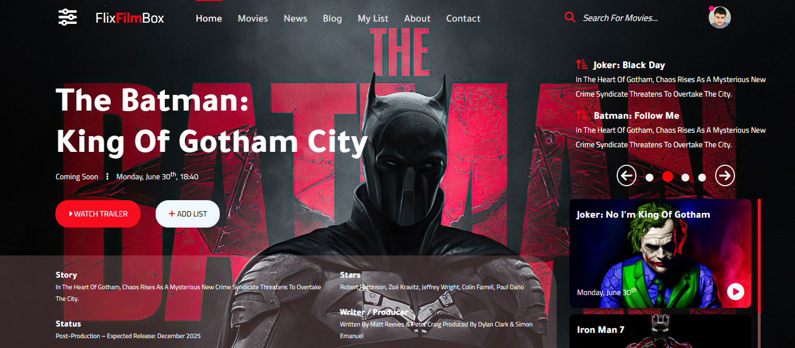

# 🎬 FlixFilmBox
Welcome to **FlixFilmBox** — a personal project inspired by modern cinema websites, crafted from scratch using only **HTML5** and **CSS3 (Flexbox)**!

---

## 📸 Project Preview

---

## 🌐 Preview
[Live Demo](https://moh-alfarjani.github.io/flixfilmbox/)

---

## 🚀 Project Overview
FlixFilmBox is my hands-on journey to master responsive web design with CSS Flexbox by building a sleek, user-friendly movie showcase UI.  
This interface features:  
- A modern, responsive navigation bar  
- A captivating hero section highlighting a featured movie with interactive CTAs  
- A smooth horizontal movie carousel  
- Detailed movie info panels (Genre, Storyline, Cast)  
- An organized, multi-column footer with social links  
- Fully responsive design optimized for all devices (desktop, tablet, mobile)

---

## 📅 Development Plan
| Day | Key Focus                          | Description                                       |
|-----|----------------------------------|-------------------------------------------------|
| 1   | Project setup & wireframing       | Initialize folders, plan layout & wireframe UI  |
| 2   | Navigation & Hero section          | Build responsive navbar and hero components     |
| 3   | Movie slider                      | Create horizontal carousel with smooth scrolling|
| 4   | Info panels                      | Design structured sections with Flexbox columns |
| 5   | Responsive footer                | Develop multi-column footer with social links   |
| 6   | UI polish & interactions          | Add hover effects, transitions, and icons       |
| 7   | Testing & documentation           | Cross-browser testing, clean code, write README |

---

## 🗂️ Project Structure
FlixFilmBox/
├── index.html
├── README.md
├── main.png
├── src/
│   ├── css/
│   │   ├── style.css
│   │   └── all.min.css
│   ├── js/
│   │   └── script.js
│   ├── img/
│   │   ├── profile.jpg
│   │   ├── top.jpg
│   │   └── scroll/
│   │       ├── 1.jpg
│   │       ├── 2.jpg
│   │       ├── 3.jpg
│   │       └── 4.jpg
│   ├── fonts/
│   │   ├── EBGaramond-Regular.ttf
│   │   ├── EBGaramond-Bold.ttf
│   │   ├── EBGaramond-SemiBold.ttf
│   │   └── fontawesome/
│   ├── vid/
│   │   └── 3.mp4

---

## 🛠️ Technologies & Tools
- **HTML5** for semantic structure  
- **CSS3 Flexbox** for advanced, responsive layouts  
- **JavaScript** (light usage) for interactivity  
- **Google Fonts:** Cairo & Tajawal  
- **Font Awesome** for icons  
- **Visual Studio Code** as the development environment  
- Local assets: images, fonts, and video stored inside `src/`

---

## 🌐 Find & Follow Me
- GitHub Repo: [github.com/moh-alfarjani/FlixFilmBox](https://github.com/moh-alfarjani/FlixFilmBox)  
- GitHub Profile: [github.com/moh-alfarjani](https://github.com/moh-alfarjani)  
- Facebook Page: [facebook.com/mohalfarjani](https://facebook.com/mohalfarjani)  
- LinkedIn: [linkedin.com/in/moh-alfarjani](https://www.linkedin.com/in/moh-alfarjani/)

---

## 💬 Final Words
Thanks for checking out FlixFilmBox!  
This project reflects my passion for clean, responsive UI design using pure CSS Flexbox — a key skill in modern frontend development.

I’m always open to feedback, collaboration, and sharing knowledge. Feel free to reach out and connect!

---

*Mohammad Alfarjani*  
Frontend Developer | Web Design Enthusiast | Flexbox Advocate

---

## 🔖 Tags / Keywords
#Movies #CinemaUI #CSSFlexbox #ResponsiveDesign #FrontendDevelopment #WebUI #FlixFilmBox  
#MovieSite #MovieTemplate #FreeTemplate #FilmWebsite #ReadyMadeWebsite #StreamingSite #MoviePortal #MovieLandingPage #FilmTemplate #FreeMovieSite #CinemaTemplate #FilmShowcase #MovieAppUI #FreeWebsiteTemplate
